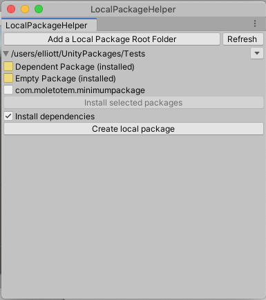

# Local-Package-Helper
A Unity tool window to show and install available local packages and for creating new local packages.

## Installation

##### Unity 2019.3 or later:
Use the Unity Package Manager to add a new package from a Github URL. Use the URL of this project:

    https://github.com/kenruze/Local-Package-Helper

##### Unity 2017.2 or later:
Edit _manifest.json_ in the "Packages" folder of your Unity project. Add an entry into the _dependencies_ section using the package name from the _package.json_ file in this repo, and the URL of this project:

    "com.moletotem.localpackagehelper": "https://github.com/kenruze/Local-Package-Helper.git",

## Operation:

Open the Local Package Helper tool window under the Window menu in Unity

Add at least one directory for local packages to be found and created in.

Use the _Save folders_ button to write the list of folders to a config file or save modifications to the list.

Use the _Refresh_ button after making changes to the list, or after making changes to local package folders externally.

The window shows local packages found in the specified root folders, and indicates if they are installed. 

Select packages and press the "install selected packages" button to install them. Available local packages listed in the dependencies will also be selected by default.

Select installed packages to remove them. The "install selected packages" button is replaced by a red, "Uninstall selected packages" button.

## Creating Local Packages

Press the "Create local package" to create a new local package. Pressing the button opens a window with configuration options and "Create Package" and "Cancel" buttons.

